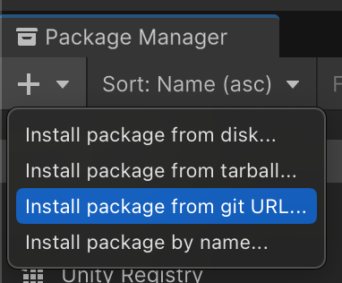
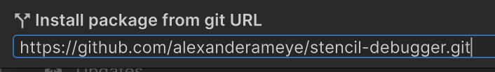
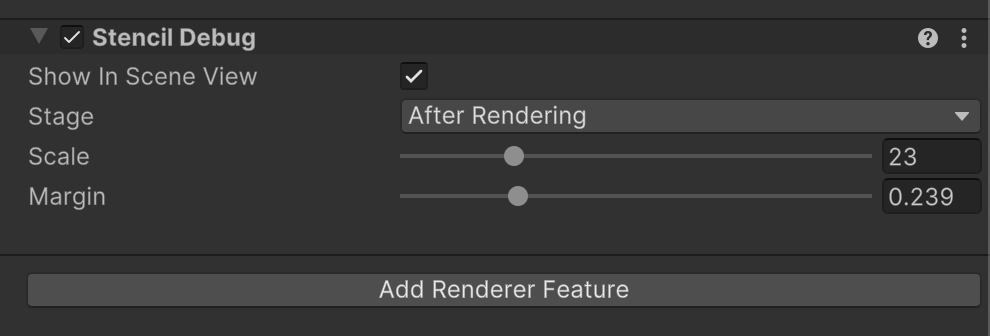

# 🔎 Stencil Debugger for Unity's Universal URP

Stencil Debugger is a utility for visualizing the stencil buffer in Unity URP. This is useful for debugging purposes when working on rendering effects that make use of the stencil buffer.

## Installation

1. Open the package manager and select the `Install package from git URL...` option found under the top left dropdown.
    
2. Enter the following link `https://github.com/alexanderameye/stencil-debugger.git`.
    
3. Click `Install`.

## Usage

After importing the package, you can check compatibility with your project through the *Window > Stencil Debugger > Compatibility* window.

- Add the Stencil Debug Renderer Feature to your renderer

## Limitations and Roadmap

**Limitations**

- Only for Unity 6 + URP
- Only allows for up to 10 stencil values to be displayed
- Not optimized for performance, only use this in the editor and do not include it in your build

**Roadmap**

- Add support for Unity 2022.3

## Attributions

The `draw_digit` method in the `StencilDebug` shader for drawing digits was written by [Freya Holmér](https://gist.github.com/FreyaHolmer/71717be9f3030c1b0990d3ed1ae833e3).
 
## Contact

[@ameye.dev](https://bsky.app/profile/ameye.dev) • [https://ameye.dev](https://ameye.dev)

> 💛 Feeling appreciative of this free package? Check out [Linework](https://assetstore.unity.com/packages/slug/294140?aid=1011l3n8v&pubref=stencil-debugger) 💛

